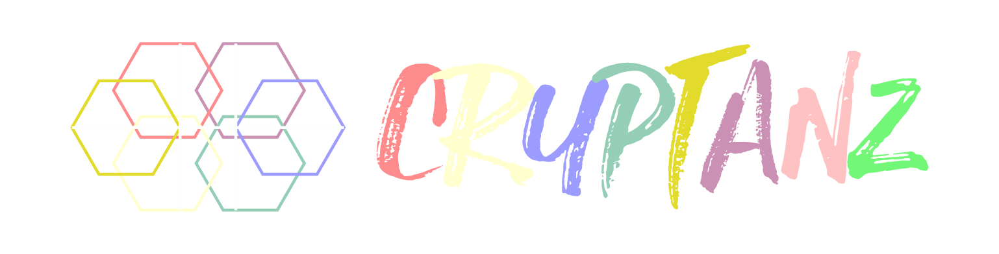
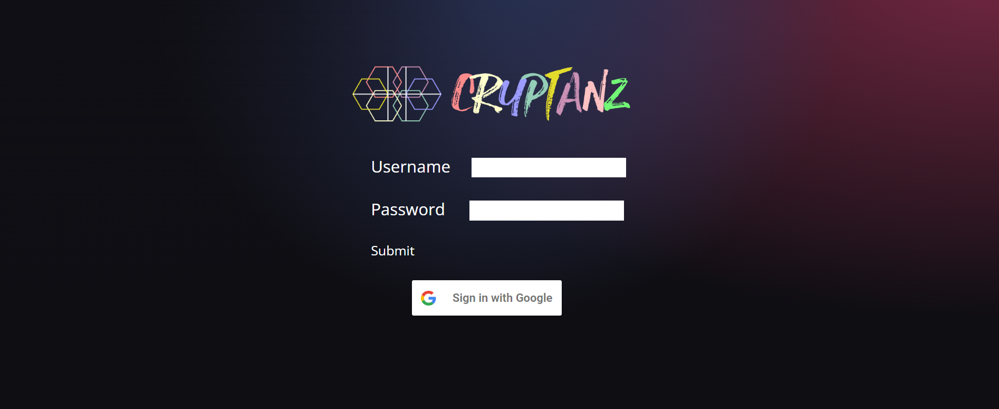
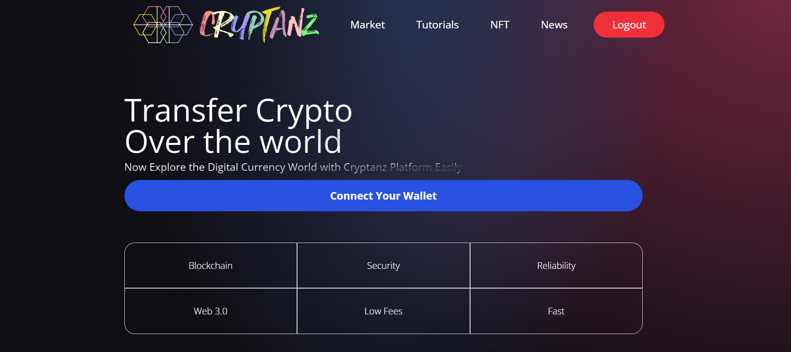
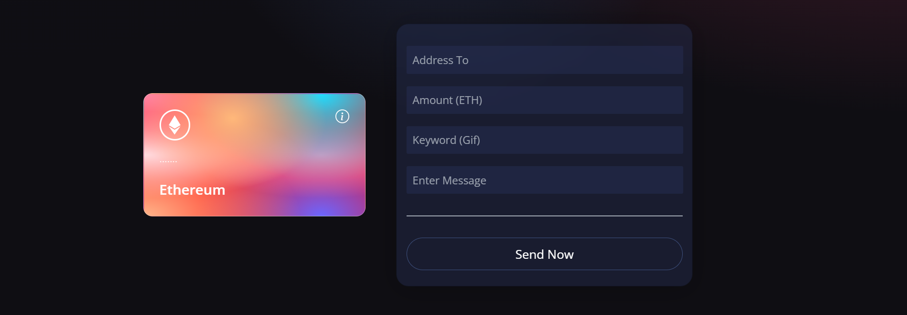

<h1 align="center">
   
  
   
  Cryptanz Blockchain Transaction System
   
</h1>

<h4 align="center"This is the system that transfer digital currencies via Ethereum chain and Ropsten network easily. For more details refer to the Project Report.</h4>

  
  
  
  
  
  
  
  
  
   
  <a href="#description">Description</a> •
  <a href="#tools-and-resources">Tools and Resources</a> •
  <a href="#how-to-run">How to Run</a> 
  

## Description

Develop a system or a product to solve a human problem or a problem that facing humans nowadays is called as an engineering solution for a existing problem. In this
case the problem is to hard to find all services which want to transfer and verify digital currency transactions in a same platform. Hence the “Cryptanz” platform is the solution for that. In normal way people can use digital wallet separately, send messages in a separate platform, view all the transactions in a different platform, etc. But in this project people can do all the services that mentioned above in one platform. That is the easiness and innovation built for the market.

### Login

In the logging system, the user can log via using his/her username and password or directly by using the google sign-in method. The logging details is using via supabase database.

### Home Page

This is the home page of the dapp system and in here you can see some of hyperlinks to different sections in the navigation bar. And also you can connect your wallet using the connect your wallet button. Also you can logout if you want to .

### Transferring System

In here the main section of the system and, you can enter the required details then the block chain transaction is done by this section. The sending time is preview by a circulating indicator when the send now button clicked.

### Latest Transactions

In here the latest transactions are displayed. Can be refer to the transparency of transactions via Etherscan by clicking on the details

## Tools and Resources

#### Tools for front-end
- react.js
- “Vite” is used to initialize the react project easily 
- “Tailwindcss” is used to style the web easily in react.js

#### Tools for smart contract
- Solidity programming language
- “Hardhat" is used for Ethereum development environment, and it allows to run solidity locally

#### Other Tools
- “Tailwindcss” is used to style the web easily in react.js 
- “Ropsten testnet” faucet website is used to get free test Ethereum because unless we have to pay Ethereum gas fees
- “Metamask” wallet extension
- “Alchemy” website is used to deploy easily the test project
- “Giffy” developers web site s used to show interactive gifs in latest transactions

## How to Run

- install node js
- create client and smart contract folders
- directed to the client folder and typed npm init vite@latest to initialize vite
- gave all details as react
- typed npm install
- typed npm run dev
- ctrl + click the localhost:3000
- typed npm install -D tailwindcss postcss autoprefixer to initialize tailwindcss
- then typed npx tailwindcss init -p
- make the path in in index.css as App.jsx in content
- change the directory to smart_contract in terminal and run npm init -y
- npm install react-icons ethers to install the icon package

